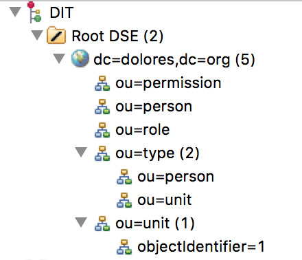

# Dolores 数据库安装指南

Dolores后端存储使用LDAP协议，本文档会帮助您顺利的搭建一台[LDAP](http://baike.baidu.com/link?url=wzAGnnyGYXjgrECbVw7e1mVMOvEjRTjuqw4L5mNBurhLZmAYGt0FlwLOypEcH2oDlDqeKEo8-c10dchxUGBsCa)服务器

#### 0x00. 安装Openldap
 [OpenLdap](www.openldap.org) 是一款开源、免费的LDAP实现，Dolores要求openldap 2.4.44 或者更高版本. [点击这里编译安装Openldap](http://www.openldap.org/doc/admin24/install.html)
#### 0x01. 配置
Openldap安装完成以后会在 `/usr/local/etc/openldap`(根据编译时`./configure --prefix`参数可能会略有差异)生成默认的配置文件。

 1. 打开`slapd.ldif`文件
 2. 给`mdb`数据库添加`olcRootDN`和 `olcRootPW`
 3. 下载`dolores`[自定义`schema`文件](https://www.github.com/DoloresTeam/dolores-ldap-init/schema/dolores.ldif) 然后在`slapd.ldif`中 `incloud path/to/core.ldif`的下方添加 `incluce path/to/dolores.ldif`
 4. 将`slapd.ldif`导入`config`数据库，命令类似 `./slapdadd -l /usr/local/etc/openldap/slapd.ldif -F /usr/local/etc/openldap -n 0 -d 3`

#### 0x02.初始化

##### 启动`LDAP`服务
 `sudo ./slapd -F /usr/local/etc/openldap -d 3`

##### 获取`Dolores`初始化程序
```
go get https://www.github.com/DoloresTeam/dolores-ldap-init
```
##### 配置`Dolores`初始化程序
``` yaml
host: 127.0.0.1 # ldap host
port: 389
subfix: dc=dolores,dc=org
rootdn: cn=admin,dc=dolores,dc=org # 注意rootDN的后缀要和上面一致
rootpwd: secret
companyname: Dolores科技有限公司
```
##### 编译执行初始化程序
``` bash
cd dolores-ldap-init
go build
./dolores-ldap-init -path ./conf.yaml
```

#### 0x03. 测试
  使用ldap可视化客户端[Apache Directory Studio](http://directory.apache.org/studio/)链接Ldap服务器，展开所有`DIT`，和下图结构类似，说明初始化成功.

